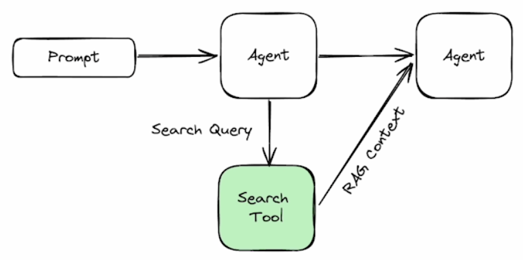

# Agentic_Notebooks
Various chunks of code for agentic workflows

## Creating a kernel
1. First create kernel is not present
```bash
python -m ipykernel install --user --name=agentic_notebook                                                      ✔  jupyter 3.11.9 Py 
```

2. Run the server
```bash
jupiter server
```

3. Connect to the URL

## Why use a search tool?
Agents need more context to have accurate and up to date information

